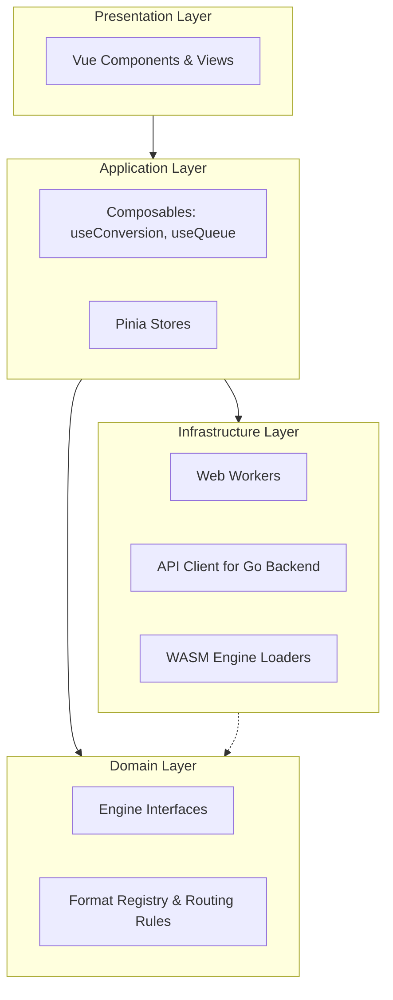
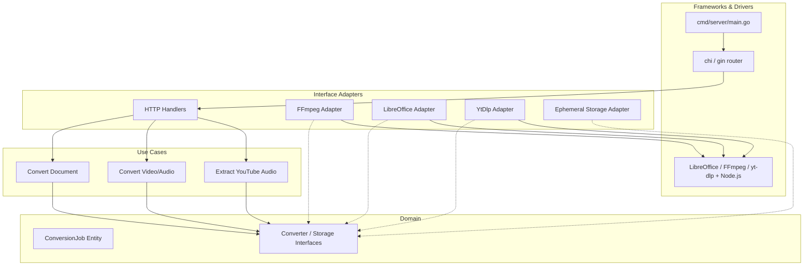

# Henka Convert — Architecture & Data Flow

This document details the system architecture, component interactions, and data flow for Henka Convert, expanding upon the technical overview.

## 1. High-Level Data Flow

Henka Convert utilizes a smart routing mechanism on the client side to determine the most privacy-respecting and efficient path for each conversion task.

```mermaid
flowchart TD
    User([User]) -->|Selects File / YouTube URL| Router[Client Format Router]
    
    Router -->|Determines Path| PathDecider{Needs Server?}
    
    PathDecider -->|No (Tier A)| LocalWorker[Web Worker Pool (WASM)]
    LocalWorker -->|Process locally| ResultLocal[Download Result]
    
    PathDecider -->|Yes (Tier B/C)| Consent[Prompt User Consent]
    Consent -->|Accepted| Upload[TLS Upload to Go Backend]
    
    Upload --> Middleware[Rate Limit / Auth Middleware]
    Middleware --> Usecase[Conversion Use Case]
    Usecase --> TempStorage[(Ephemeral Storage)]
    Usecase --> Subprocess[os/exec LibreOffice/FFmpeg/yt-dlp]
    
    Subprocess --> StreamBack[Stream Result to Client]
    StreamBack --> CleanUp[Delete Temp Files]
    CleanUp --> ResultRemote[Download Result]
```

## 2. Frontend Architecture (Vue 3)

The frontend follows a Clean Architecture approach to separate framework-specific UI from core conversion logic.



- **Domain:** Pure TypeScript/JavaScript. Contains the rules mapping input/output extensions to the required engine (e.g., `jpg -> webp` requires `jSquash`).
- **Infrastructure:** Handles the dirty work. Spawns Web Workers, loads heavy WASM payloads asynchronously, or constructs `FormData` for backend API calls.
- **Application:** Orchestrates state. Manages progress bars, job queues, and error handling.
- **Presentation:** Dumb UI components that render state from the application layer.

## 3. Backend Architecture (Go)

The Go backend acts as a stateless processing node. It is designed to be highly scalable and simple to self-host.



- **Ephemeral Storage Adapter:** Crucial for privacy. Implements the `domain.Storage` interface. Guarantees that any file written is tracked and removed via `defer` or scheduled cleanup as soon as the HTTP request context ends.
- **Subprocess Adapters:** The backend uses `os/exec` to call native binaries (like `ffmpeg`, `soffice`, or `yt-dlp`) rather than using CGO bindings. This ensures stability (a crash in LibreOffice won't crash the Go server) and simplifies the Docker image. For YouTube extraction, `yt-dlp` routes its signature-decryption processes through a bundled `Node.js` runtime to effectively bypass anti-bot mechanisms.

## 4. Deployment Model

For production deployment, the architecture is split:

1.  **Static Frontend Delivery:** The Vue app is compiled to static files (`dist/`) and hosted on a CDN (e.g., Vercel, Cloudflare Pages).
2.  **Stateless Backend Nodes:** The Go server is containerized. The Dockerfile bundles the compiled Go binary, LibreOffice headless, FFmpeg, yt-dlp, and Node.js. These containers can be run on platforms like AWS Fargate, Google Cloud Run, or any Kubernetes cluster. They do not require persistent volumes.
3.  **Horizontal Scaling:** Because the backend is stateless (state is only kept in ephemeral storage for the duration of a single request), scaling simply involves adding more container replicas behind a Load Balancer. Rate limiting can be coordinated via a Redis instance if necessary.
