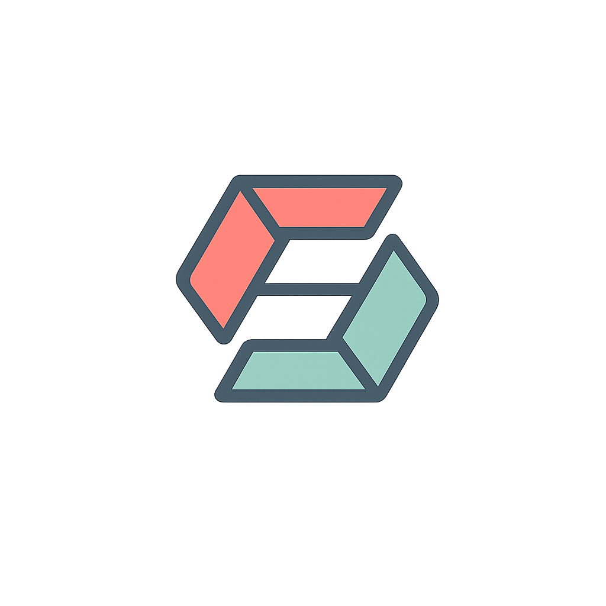

<div align="center">
  
  <h1>Henka Convert</h1>
  <p><strong>A modern, hybrid local/cloud file conversion toolkit and YouTube downloader.</strong></p>
  
  [](https://vuejs.org/)
  [](https://go.dev/)
  [](https://tailwindcss.com/)
  [](https://www.docker.com/)
</div>

<hr />

Henka Convert is a state-of-the-art web application that converts media, documents, and data formats seamlessly. It utilizes a combination of **Local WebAssembly (WASM)** processing for privacy and speed, and **Cloud/Server-Assisted Processing** for heavy computational tasks. 

It is built from the ground up with a strong emphasis on **Clean Architecture**, **SOLID principles**, and a **premium User Experience**.

---

## ✨ Features

- 🧠 **Hybrid Processing Architecture**: Intelligently routes tasks to run locally (Browser) or on the server.
- 🎥 **YouTube to Media**: Download and extract high-quality Audio (MP3, WAV, etc.) and Video (MP4, WebM) from YouTube using `yt-dlp` with dynamic quality selection.
- 📦 **Batch Processing**: Convert multiple files at once and download them seamlessly as a compiled `.zip` file.
- 🛡️ **Strict Format Routing**: Target formats are strictly filtered dynamically. The UI refuses to make false promises; if a conversion engine doesn't exist, the option won't exist.
- 🪄 **Asymptotic Progress UI**: Beautiful, smooth, and realistic progress bars inspired by Zeno's paradox, completely eliminating awkward progress jumps and UI stutters.
- 📄 **PDF Toolkit**: Client-side PDF manipulation powered by `pdf-lib` (Merge, Rotate, etc.).

### 🔄 40+ Supported Formats
- 🖼️ **Image:** `JPG`, `PNG`, `WEBP`, `GIF`, `BMP`, `TIFF`, `ICO`, `SVG`, `HEIC`, `EPS` _(WASM & ImageMagick)_
- 📊 **Data:** `CSV`, `JSON`, `XLSX` _(JS/Local)_
- 📑 **Document:** `DOCX`, `DOC`, `RTF`, `TXT`, `ODT`, `HTML`, `XLSX`, `XLS`, `PPTX`, `PPT` ➔ `PDF` _(LibreOffice/Server)_
- 🎬 **Video:** `MP4`, `WEBM`, `GIF`, `AVI`, `MOV`, `MKV`, `WMV`, `FLV`, `M4V`, `3GP`, `TS`, `VOB` _(FFmpeg/Server)_
- 🎵 **Audio:** `MP3`, `WAV`, `FLAC`, `AAC`, `M4A`, `OGG`, `WMA`, `OPUS`, `AIFF` _(FFmpeg/Server)_

---

## 🛠️ Tech Stack

- **Frontend**: Vue 3 (Composition API), Vite, Tailwind CSS, TypeScript, Web Workers, Pinia.
- **Backend**: Go (Golang), Gin Framework, Clean Architecture.
- **Tools/Engines**: FFmpeg, LibreOffice, ImageMagick, yt-dlp, Node.js, JSZip.

---

## 🚀 Getting Started

### Prerequisites
- [Docker](https://www.docker.com/) & [Docker Compose](https://docs.docker.com/compose/)
- [Node.js](https://nodejs.org/) & npm (for local frontend dev)

### Running the Backend (Docker)
The backend is fully containerized with Hot-Reloading (`air`) and includes all heavy system dependencies (FFmpeg, LibreOffice, ImageMagick, yt-dlp) pre-configured.

1. Navigate to the backend directory:
   ```bash
   cd henka-backend
   ```
2. Start the backend services:
   ```bash
   docker-compose up --build
   ```
   > *The Go API will be available at `http://localhost:8080`.*

### Running the Frontend
1. Open a new terminal and navigate to the frontend directory:
   ```bash
   cd henka-frontend
   ```
2. Install dependencies:
   ```bash
   npm install
   ```
3. Start the Vite development server:
   ```bash
   npm run dev
   ```
   > *The app will be available at `http://localhost:5173`.*

---

## 🏛️ Architecture Principles

This project strictly enforces **Ports & Adapters (Hexagonal)** architecture on both the Frontend and Backend to ensure zero tight-coupling:
- **`core/domain`**: Entities and core business models.
- **`core/ports`**: Interfaces defining the behavioral contracts.
- **`core/application`**: Usecases orchestrating the flow.
- **`infrastructure`**: Concrete implementations (Adapters, HTTP Handlers, External Tools).

See `ARCHITECTURE.md` and `HENKA_CONVERT_TECHNICAL_OVERVIEW.md` in this repository for deep dives into the implementation details.

---
<div align="center">
  <i>Built with a passion for seamless developer and user experiences.</i>
</div>
