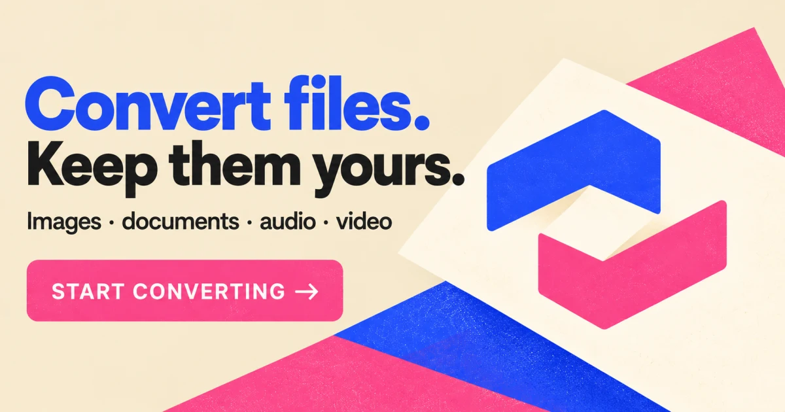

# Henka Convert

<p align="center">
  
</p>

<p align="center">
  A browser-based file lab for everyday format changes.<br />
  Files are converted on your device. The site is served as static frontend assets.
</p>

<p align="center">
  <a href="#quick-start">Quick start</a> ·
  <a href="#supported-formats">Supported formats</a> ·
  <a href="docs/architecture.md">Architecture</a> ·
  <a href="docs/format-matrix.md">Format matrix</a>
</p>

## At a glance

| Area                | Technology                                   |
| ------------------- | -------------------------------------------- |
| **App**             | SvelteKit, Svelte 5, TypeScript              |
| **Styling**         | Tailwind CSS v4                              |
| **Deployment**      | Static output via `@sveltejs/adapter-static` |
| **Conversion**      | Client-side modules and Web Workers          |
| **Package manager** | Bun                                          |

## Technology

| Area                  | Tools and libraries                                                                   |
| --------------------- | ------------------------------------------------------------------------------------- |
| **App and interface** | SvelteKit, Svelte 5, TypeScript, Vite, Tailwind CSS v4, Bits UI, and `@lucide/svelte` |
| **Images**            | WebAssembly codecs for JPEG, PNG, WebP, AVIF, and JPEG XL; `elheif` and `gifenc`      |
| **Documents and PDF** | Mammoth, Marked, Turndown, LinkeDOM, `docx`, PDF.js, and `pdf-lib`                    |
| **Tables**            | Papa Parse and SheetJS Community Edition                                              |
| **Audio and video**   | FFmpeg.wasm with fixed codec profiles                                                 |

Tailwind utilities handle component layout, spacing, type, colors, and responsive behavior. `src/app.css` contains the global theme and motion rules; scoped CSS is reserved for SVG artwork and browser-specific details.

## What it does

Henka brings common file conversions into one workspace. Choose a tool, add a file, select an output format, and download the result from your browser.

- **Images and PDFs:** convert image formats, export PDF pages, or create a PDF from images.
- **Documents and tables:** work with text documents, CSV, JSON, spreadsheets, and HTML tables.
- **Audio and video:** convert common media formats using FFmpeg.wasm.
- **Local processing:** selected files are handled in the browser and are not sent to a conversion API.

Audio and video tools download the FFmpeg.wasm engine the first time you use them. The bundled core is about 31 MB.

## Quick start

You will need [Bun](https://bun.sh/) installed.

```sh
bun install
bun run dev
```

Vite prints the local development URL in the terminal. Use these commands to check the app and build the static site:

```sh
bun run check
bun run build
```

## Pages

| Route           | Purpose                                          |
| --------------- | ------------------------------------------------ |
| `/`             | Product overview and entry point to the file lab |
| `/convert`      | File conversion workspace                        |
| `/formats`      | Supported formats and conversion paths           |
| `/how-it-works` | Conversion steps and processing details          |
| `/help`         | Answers to common questions                      |
| `/privacy`      | File processing and privacy information          |
| `/about`        | Product principles and background                |

## Supported formats

Henka supports image, document, table, audio, and video conversion. Some formats have limits or experimental paths, so check the [full format matrix](docs/format-matrix.md) before relying on a specific conversion.

<details>
  <summary>View format groups and conversion notes</summary>

### Images

- **Inputs:** JPG, PNG, WebP, AVIF, SVG, BMP, TIFF, GIF, ICO, JPEG XL, HEIC, and HEIF.
- **Outputs:** JPEG, PNG, WebP, AVIF, HEIC, BMP, TIFF, GIF, ICO, JPEG XL, SVG, and PDF.
- GIF and multi-page TIFF inputs use their first frame or page. Raster-to-SVG embeds a PNG image; it does not trace or vectorize pixels.

### Documents and PDFs

- Convert images to PDF.
- Export PDF pages as PNG, JPEG, WebP, AVIF, HEIC, BMP, TIFF, GIF, ICO, or JPEG XL, or extract selectable text.
- DOCX, HTML, TXT, and Markdown can be converted between supported text formats. DOCX conversion keeps basic text structure; complex layout, styling, and embedded media may be lost. HTML output is sanitized.
- DOCX-to-HTML, text, and Markdown conversion is experimental.

### Tables

- **Formats:** CSV, TSV, JSON, XLSX, XLS, ODS, and HTML tables.
- CSV and TSV use the first row as headers and keep cells as text. JSON input must be an array of flat objects.
- Spreadsheet conversion uses one selected worksheet and exports one worksheet. Formulas, macros, and styling are not preserved. HTML input reads the first table.
- Data table conversion runs in a browser worker and accepts files up to 20 MB. XLSX worksheets are limited to 1,000,000 cells per conversion.

### Audio and video

- **Audio:** MP3, WAV, M4A/AAC, OGG/Opus, FLAC, AIFF, and WMA.
- **Video:** MP4, MOV/QuickTime, WebM, MKV, AVI, M4V, 3GP, MPEG/MPG, and TS.
- Output codec profiles depend on the selected container. They include H.264/AAC, VP9/Opus, MPEG-4/MP3, or MPEG-2/MP2 for video.
- Conversion uses a single-thread FFmpeg.wasm core. Runtime depends on the file and device.

</details>

## Project map

| Location                                                                  | Responsibility                                              |
| ------------------------------------------------------------------------- | ----------------------------------------------------------- |
| `src/routes`                                                              | SvelteKit pages and sitemap endpoint                        |
| `src/lib/features/converter/ui`                                           | File selection, format options, and conversion results      |
| `src/lib/features/converter/application`                                  | Conversion workflow and orchestration                       |
| `src/lib/features/converter/{image,pdf,documents,data,audio,video,media}` | Format definitions, conversion engines, workers, and errors |
| `src/lib/features/preferences`                                            | Browser-persisted language and theme preferences            |
| `src/lib/features/marketing`                                              | Localized page copy and shared informational UI             |
| `src/lib/seo`                                                             | Canonical URLs, social image path, and indexable routes     |
| `static`                                                                  | Brand assets, icons, and crawler-facing files               |

Browser-only conversion engines load when their converter is selected. Keep these imports out of server-rendered module scope. See [the architecture guide](docs/architecture.md) for dependency and change rules.

The visual direction and color palette are documented in [DESIGN.md](DESIGN.md).

## Static deployment

`bun run build` writes the site to `build/` through `@sveltejs/adapter-static`. Routes must remain prerenderable. Henka has no conversion backend, database, or file upload service.

## License note

The bundled `@ffmpeg/core` package is licensed under GPL-2.0-or-later. Review the engine's license and distribution obligations before publishing a release.

## References

- [SvelteKit project setup](https://svelte.dev/docs/kit/creating-a-project)
- [SvelteKit static site generation](https://svelte.dev/docs/kit/adapter-static)
- [Tailwind CSS with SvelteKit](https://tailwindcss.com/docs/installation/framework-guides/sveltekit)
- [Bits UI](https://www.bits-ui.com/)
